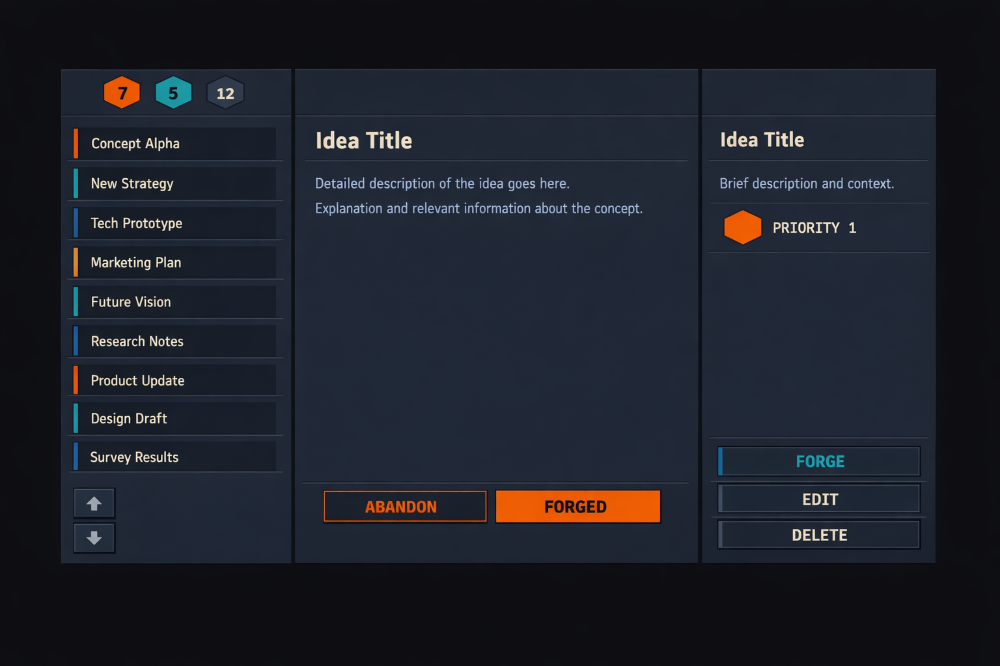

A desktop application UI mockup, landscape orientation. Outer background #1a1a1a. Three fixed vertical columns side by side, each background #22303C, divided by single 1px vertical lines in #415A77. No rounded corners anywhere. No shadows. No gradients. No depth. Everything flat on the same surface plane.

LEFT COLUMN — SHELF:
At the top, three small hexagons side by side, first filled #FF6A00 with number inside Inter Bold #0D1B2A, second filled #00D2C3 with number inside Inter Bold #0D1B2A, third filled #415A77 with number inside Inter Bold #E6D5B8. Below, a vertical list of idea blocks, each background #22303C, 3px left border — some #FF6A00, some #00D2C3, some #415A77 — separated by 1px horizontal lines #415A77. Inside each block one short title Inter Medium #E6D5B8 12px. At the bottom two small square buttons stacked, up arrow and down arrow, 1px border #415A77, icon #6C7A89.

CENTER COLUMN — ANVIL:
Idea title Inter SemiBold #E6D5B8 18px. Below, description text Inter Regular #8A9BB0 12px. At the bottom two buttons side by side: ABANDON 1px border #F05A22 text #F05A22 Inter Bold uppercase background #22303C. FORGED filled #F05A22 text #0D1B2A Inter Bold uppercase.

RIGHT COLUMN — CONTEXTUAL PANEL:
Idea title Inter SemiBold #E6D5B8 16px. Description Inter Regular #8A9BB0 12px. Below, small faceted hexagon filled #FF6A00 with label PRIORITY 1 beside it in JetBrains Mono 10px #E6D5B8. At the bottom three buttons stacked: FORGE 1px border #00D2C3 text #00D2C3 Inter Bold uppercase background #22303C. EDIT 1px border #415A77 text #E6D5B8 Inter Bold uppercase background #22303C. DELETE 1px border #415A77 text #E6D5B8 Inter Bold uppercase background #22303C.

Overall style: flat UI, dark engineering, data-dense, brutalist editorial, sci-fi minimal. No depth, no shadows, no glow, no gradients, no rounded corners. Typography and borders are the only structure.

# Contextual image

